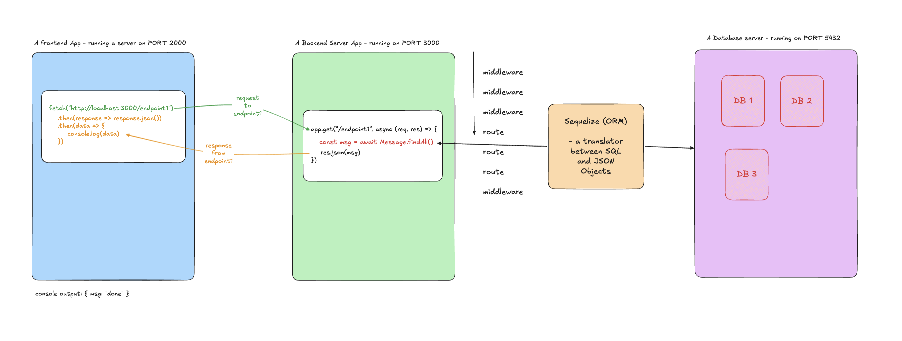

# Assignment 12: Full-Stack Workshop — Quotes App

## Goal

Connect all three layers of the PERN stack in one working app: a React frontend that sends requests to an Express server that reads and writes to a PostgreSQL database through Sequelize. By the end, clicking a button in the browser creates a real row in a real database — and stays there after the server restarts.

## Why This Matters

You have built each piece of this separately:
- **React** — you built UIs and fetched data from external APIs.
- **Express** — you built servers and tested them with Postman.
- **Sequelize + PostgreSQL** — you replaced in-memory arrays with a real database.

Today you connect all three. The frontend is no longer talking to some server out on the internet — it's talking to *your* server. And your server is no longer forgetting data on restart — it's writing to a real database. This is how a real web app works.

## Objectives

- Wire a Sequelize connection to a PostgreSQL database.
- Define a model and sync it to create a table.
- Complete three Express routes that perform real database operations.
- Write three fetch calls in React that talk to those routes.
- Verify that data persists after a server restart.

## Resources

- Sequelize — Getting Started: https://sequelize.org/docs/v6/getting-started/
- Sequelize — Model Querying Basics: https://sequelize.org/docs/v6/core-concepts/model-querying-basics/
- fetch API: https://developer.mozilla.org/en-US/docs/Web/API/Window/fetch

---

## Setup — Two Repos, Two Terminals

This project has a backend and a frontend. Both need to be running at the same time.

**Terminal 1 — Backend:**
- [ ] Go to https://github.com/aghaffar570/quotes-backend and click **Fork**
- [ ] Clone your fork: `git clone <your-fork-url>`
- [ ] `cd quotes-backend`
- [ ] `npm install`
- [ ] Install Sequelize: `npm install sequelize pg pg-hstore`
- [ ] Create a database named `quotes` in Postico or pgAdmin

**Terminal 2 — Frontend:**
- [ ] Go to https://github.com/aghaffar570/quotes-frontend and click **Fork**
- [ ] Clone your fork: `git clone <your-fork-url>`
- [ ] `cd quotes-frontend`
- [ ] `npm install`
- [ ] `npm run dev`
- [ ] Open the URL Vite gives you in a browser

**Check it:** The browser shows a page with three sections ("All Quotes", "Add a Quote", "Delete a Quote") and no errors in the console. The backend terminal is still open and shows `Server running on port 8080`.

**Do not start writing code until both are running.**

---

## Part 1: Database Connection

**Why:** Sequelize can't run a single query until it knows which database to talk to.

Open `db/index.js` in `quotes-backend`. The comments inside walk you through the three steps.

- [ ] Import `Sequelize` from the `sequelize` package.
- [ ] Create a new Sequelize instance connected to your `quotes` database.
- [ ] Export the instance.

**Hint:** the connection string format is `postgres://localhost:5432/quotes`. Check the Getting Started doc if you're not sure where this goes.

---

## Part 2: Quote Model

**Why:** Sequelize needs a JavaScript description of what a Quote looks like before it can create the table or run any queries against it.

Open `models/Quote.js`. The comments inside list the fields.

- [ ] Import `DataTypes` from `sequelize`.
- [ ] Import your `db` connection from `../db`.
- [ ] Define a `Quote` model with `text` (required) and `author` (required).
- [ ] Export the model.

**Explain:** `id`, `createdAt`, and `updatedAt` are not in the field list. Where do they come from?

---

## Part 3: Connect and Sync in app.js

**Why:** Defining a model doesn't touch PostgreSQL until you sync. And you can't use the db or the model in your routes until you import them.

Open `app.js`.

- [ ] Import your `db` connection at the top.
- [ ] Import your `Quote` model at the top.
- [ ] Inside `startApp()`, call `db.sync()` and await it before `app.listen` runs.
- [ ] Start the server: `node app.js`

**Check it:** The server logs `Server running on port 8080`. Open Postico or pgAdmin — a `Quotes` table should now exist inside your `quotes` database. It will be empty — that's expected.

**Explain:** what would happen if you called `app.listen` before `db.sync()` resolved, and a request came in immediately?

---

## Part 4: Backend Routes

**Why:** This is where the data actually gets created, read, and deleted. Each route is a function that receives an HTTP request and talks to the database.

Still in `app.js`, complete the three route bodies. The comments inside each route give you the steps.

- [ ] `GET /api/quotes` — fetch every quote from the database and send them back as an array.
- [ ] `POST /api/quotes` — create a new quote from `req.body` and respond with `201` and the new quote.
- [ ] `DELETE /api/quotes/:id` — find the quote by id, delete it, respond with `204`. Send `404` if not found.

**Check it:** Test all three routes in Postman before touching the frontend. If a route doesn't work in Postman, it won't work in the browser either — fix it here first.

**Explain:** `DELETE /api/quotes/:id` uses `req.params.id` to get the id. Why do you need to wrap it in `Number()` before using it with Sequelize?

---

## Part 5: Frontend — Connect the Buttons

**Why:** The server is ready. Now the browser needs to know how to talk to it. Each button click should send an HTTP request, wait for the response, and update the page.

Open `src/App.jsx` in `quotes-frontend`. Find the three `async function` stubs. Each one has step-by-step comments inside.

- [ ] `loadQuotes()` — fetch `GET /api/quotes`, convert to JSON, call `setQuotes` with the result.
- [ ] `handleCreate()` — fetch `POST /api/quotes` with the quote text and author in the body, add the new quote to state, clear the inputs.
- [ ] `handleDelete()` — fetch `DELETE /api/quotes/${deleteId}`, remove that quote from state, clear the input.

**Check it:**
1. Click "Load Quotes" — the page starts empty, and the list should be empty too (no quotes yet).
2. Fill in the Add form and submit — the new quote appears in the list.
3. Click "Load Quotes" again — the new quote is still there (it came from the database, not just state).
4. Stop the server (`Ctrl+C`) and restart it (`node app.js`). Click "Load Quotes" — the quote is still there. That's the difference from an array.
5. Type a quote's id in the Delete section and click Delete — the quote disappears from the list and from the database.

---

## Common Gotchas

- **The list shows up but it's empty after adding a quote:** you're updating state locally but not calling `setQuotes` after the POST. Make sure you add the new quote to the array.
- **CORS error in the browser:** confirm `app.use(cors())` is in `app.js` and above your routes.
- **`req.body` is `undefined` on POST:** confirm `app.use(express.json())` is in `app.js` and above your routes.
- **Sequelize error on startup:** the model wasn't imported before `db.sync()` was called. Make sure your `require` calls are at the top of `app.js`.
- **Nothing happens when I click the button:** check the backend terminal for errors. Does the request arrive? Start there before looking at the frontend.

---

## How to Submit Your Work

You have two repos — submit both.

**Backend:**
- [ ] `cd quotes-backend`
- [ ] `git add .`
- [ ] `git commit -m "complete quotes backend"`
- [ ] `git push`

**Frontend:**
- [ ] `cd quotes-frontend`
- [ ] `git add .`
- [ ] `git commit -m "connect quotes frontend"`
- [ ] `git push`

**Submit:** paste both fork URLs.

---

## Finished Checklist

Before submitting, verify:

- [ ] `node app.js` starts without errors and logs "Server running on port 8080".
- [ ] A `Quotes` table exists in Postico/pgAdmin.
- [ ] All three routes work in Postman (GET, POST, DELETE).
- [ ] Clicking "Load Quotes" shows quotes from the database.
- [ ] Submitting the form adds a quote — it appears in the list and in Postico/pgAdmin.
- [ ] After restarting the server, quotes are still there.
- [ ] Deleting a quote removes it from the list and from the database.
- [ ] Both repos are committed and pushed.

---

## Stretch Challenges

- [ ] Add a `GET /api/quotes/:id` route and a "Find by ID" section in the frontend.
- [ ] Add a `PATCH /api/quotes/:id` route and an "Edit Quote" form in the frontend.
- [ ] Show a "Loading..." message while the fetch is in progress.
- [ ] Show an error message if the backend isn't running and the fetch fails.
- [ ] Add a `?author=` filter to `GET /api/quotes` and a search input in the frontend.
