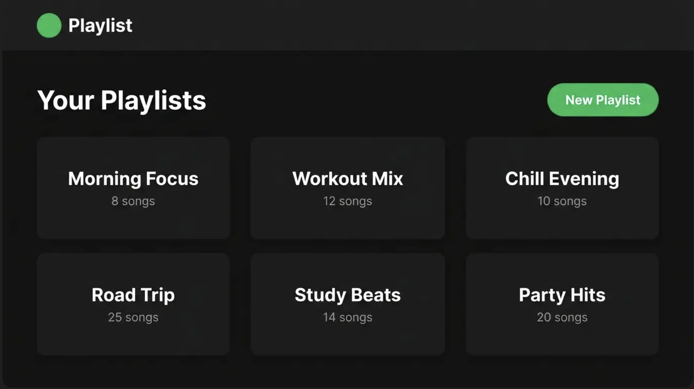
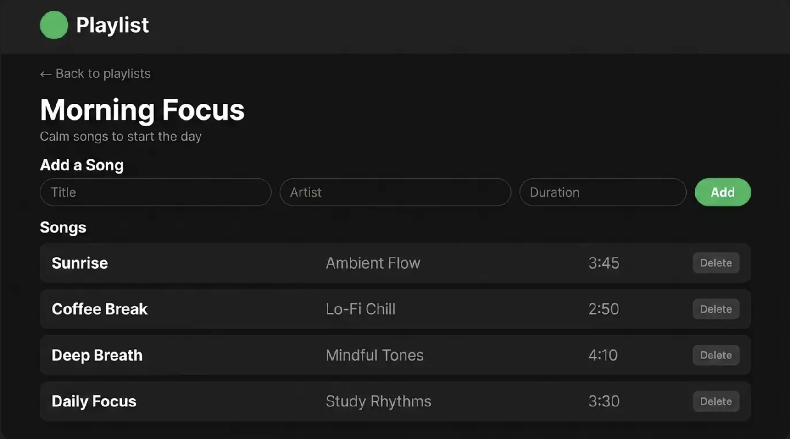

# Fullstack Review Workshop — "Playlist"

A simplified Spotify. Built from scratch with the full PERN stack.

**PostgreSQL · Express · React (Vite) · Node · Sequelize**

---

## How This Workshop Is Different

Every workshop before this one gave you steps. This one gives you **a picture and expectations.**

You already know how to build each layer. You have built a React app. You have built an Express API. What you have never done is build a feature **all the way through the stack** and plan it yourself.

That is the whole point today. On the job, nobody hands you steps. Someone hands you a picture of a screen and says "build this." You work out what it needs — the tables, the routes, the pages — and then you build it. That planning is the skill this workshop is testing.

So there is no "Show the code" toggle this time. There are the **screens** you are building toward, a **plan you write first**, and expectations to check yourself against. When you get stuck, that is the work — not a detour from it. This is exactly what capstone will ask of you.

---

## What You Are Building

A web app where a user can create playlists and add songs to them.

Here are the screens. **This is your spec.** Everything you need to plan is in these pictures — read them closely.

**The home page — all your playlists:**



**The detail page — one playlist, its songs, and a form to add more:**



> Build the **behavior** in these screens, not the exact pixels. Matching colors and spacing is a stretch goal. Getting the app to work is the goal. Do not spend your first hour on CSS.

Two things the app keeps track of, and one relationship between them:
- A **playlist** has many songs.
- A **song** belongs to a playlist.

That single one-to-many relationship is the heart of this project. Everything else is CRUD around it.

---

# Phase 0 — Plan Before You Build

**Do not write any code yet.** First you plan. This is the part that makes today different, so give it real time — twenty minutes with the screens and a scratch file, before you touch a terminal.

Look at the screens above and answer these four questions **in your own words first.** Each one has a reveal so you can check your thinking — but only open it *after* you have your own answer. Opening it first is the same as copying the code toggle before trying the step: you learn nothing.

### 1. The data — what are you storing?

SEQUELIZE REF: https://sequelize.org/docs/v6/getting-started/

- What are the two things this app keeps track of?
- What fields does each one need? *(Hint: every piece of text on a card or a form is a field.)*
- How are the two things connected?

<details>
<summary>Check your plan — the data</summary>

- Two things: **Playlists** and **Songs**.
- A **Playlist** needs at least a **name** and a **description**.
- A **Song** needs at least a **title**, an **artist**, and a **duration**.
- The connection: one playlist has **many** songs; each song belongs to **one** playlist. That is a one-to-many relationship, and it means a **Song** needs to know which playlist it belongs to.

> For spotify, a song can be in multiple playlists, so it would be considered a Many to Many relationship. For this workshop, we'll keep it simple and say that a single song can only be a part of one playlist.

> **A word on duration.** The screen shows `3:45`, but do **not** store it that way. Store duration as a **number of seconds** (`225`), and format it as `3:45` on the frontend when you display it. A number is easy to add up and sort; a string like `"3:45"` is not. This choice is what makes the stretch goals (total playlist duration, sorting by length) actually possible.

</details>

### 2. The API — what routes does the browser need?

For every action a user can take on the screens, the browser has to send one request to your server. Walk the screens button by button and list them.

EXPRESS REF: https://expressjs.com/en/5x/starter/basic-routing/

API REF: https://docs.google.com/document/d/1gMWcFuuXX0tKbFtLZjOD1WKMf3WCrZthQ7e_MRvl89A/edit?tab=t.0

- Write each one as **method + path** (for example, "GET /playlists — get all playlists").
- Do not write code. Just the list.

<details>
<summary>Check your plan — the routes</summary>

**Playlists:**
- Get all playlists (for the list page)
- Get one playlist, with its songs (for the detail page)
- Create a playlist
- Update a playlist
- Delete a playlist

**Songs:**
- Add a song to a specific playlist
- Delete a song

If your list is close to this, you planned it right. The exact paths are your choice.

</details>

### 3. The pages — what does the UI need?

- How many pages are there?
- What lives on each page?
- What does clicking a playlist do?

REACT REF: https://react.dev/reference/react

REACT ROUTER REF: https://reactrouter.com/start/declarative/routing

<details>
<summary>Check your plan — the pages</summary>

- A **list page** showing every playlist, plus a way to create a new one.
- A **detail page** for one playlist, showing its songs, plus a way to add a song.
- Clicking a playlist opens **its own URL** (client-side routing) — the detail page for that playlist.

</details>

### 4. Trace one feature all the way through

This is the most important question. Pick the single action **"add a song to a playlist."** In plain words, write down *everything* that has to happen — from the moment the user clicks the button to the moment the new song appears on screen. Your trace has to touch **all three layers.**

<details>
<summary>Check your plan — the trace</summary>

1. The user types a song into the form and clicks the button.
2. React stops the page from reloading, and calls a function that sends a request to your Express server.
3. The request travels over HTTP to a route on your server (a POST, carrying the song in its body).
4. The route reads the body and asks Sequelize to create a new song attached to that playlist.
5. Sequelize writes a new row into the `Songs` table in Postgres, with the playlist's id in the foreign key column.
6. The route sends a response back — the new song, or a success status.
7. React gets the response and updates its state (or re-fetches the playlist).
8. Because state changed, React re-renders and the new song appears in the list.

**That path — form → fetch → route → Sequelize → database → response → state → re-render — is what "fullstack" means.** Keep it in your head. When something breaks today, you will walk this exact path to find which step failed.

</details>

**You are ready to build when you can answer all four without opening the reveals.**

---

## The Stack, Confirmed

- **Database:** PostgreSQL (local)
- **ORM:** Sequelize
- **Server:** Node + Express
- **Client:** React with Vite
- Two servers running at once: the Express API and the Vite dev server.

---

## Build Order — Thinnest Slice First

You have your plan. Now here is *how* to build it without drowning.

Do **not** build the entire database, then the entire API, then the entire frontend. If you do, the first time React talks to your server, ten things break at once and you cannot tell which. Instead, build the **thinnest slice that goes all the way through the stack**, prove it works end to end, then widen.

**First pass — the walking skeleton (your MVP).** Build only `enough of each layer` to get one round-trip working:
1. The two models and the relationship, plus a small seed script so you have data to look at.
2. Just these routes: get all playlists, get one playlist with its songs, create a playlist, add a song. Test them in Postman.
3. Just these pages: the list page, the detail page, a form to create a playlist, a form to add a song.

When you can create a playlist in the browser, open it, and add a song — and it survives a refresh — your skeleton is alive. **Everything hard is now just repeating a pattern you already have working.**

**Second pass — fill it in.** Come back and add: update a playlist, delete a playlist (mind the songs!), delete a song, the loading and error states everywhere, and any fields you skipped.

The parts below are written bottom-up (database → API → React), because that is the order that causes the least pain. The ⭐ items are your first-pass skeleton. Everything else is the second pass.

> Do not write a single line of React until your API works in Postman. A frontend built on a broken API is impossible to debug — you won't know which layer is wrong.

---

# Part 1 — Database & Models

## Goal

A working database connection, two models, and the relationship between them declared correctly.

## Expectations

- ⭐ One Sequelize instance, connected to a local Postgres database, exported from a single file that everything else imports.
- ⭐ A **Playlist** model with at minimum: a name and a description.
- ⭐ A **Song** model with at minimum: a title, an artist, and a duration (store as **seconds — a number** — and format as `3:45` on the frontend).
- ⭐ The one-to-many association declared on **both** sides (`hasMany` and `belongsTo`).
- ⭐ The foreign key (something like `playlistId`) should be created automatically by the association — you should not define it by hand.
- ⭐ A sync step that actually creates the tables from your models.
- ⭐ A seed script that fills the database with a few playlists and several songs. Do this in the first pass — an empty app is hard to test. If your list page has nothing to render, you can't tell whether it's broken or just empty. Seeded data means the frontend shows something the moment it loads.

## Gotchas to Watch For

- The association must be declared **before** `sync()` runs, or the foreign key column will not be created.
- `sync({ force: true })` wipes all data. Use it in your seed script only. Never in normal startup.
- Sequelize auto-pluralizes and PascalCases table names (`Playlists`, `Songs`).
- Think about what should happen to songs when a playlist is deleted. A song should never be left pointing at a playlist that no longer exists. *(This matters in the second pass, when you add delete — but decide it now.)*

## ✅ Done When

- You can open your database in Postico / Beekeeper / pgAdmin and see two tables.
- The `Songs` table has a foreign key column pointing at `Playlists`.
- Your seed script runs and fills both tables.
- Restarting does not lose the seeded data (unless you re-run the seed).

---

# Part 2 — Express API

## Goal

A REST API for playlists and their songs, tested entirely in Postman before any frontend exists.

## Expectations

**Playlists:**
- ⭐ Get all playlists.
- ⭐ Get one playlist by id — with its songs included.
- ⭐ Create a playlist.
- Update a playlist.
- Delete a playlist.

**Songs — scoped to their playlist:**
- ⭐ Add a song to a specific playlist.
- Get all songs in a specific playlist.
- Delete a song.

**Across the whole API:**
- Routes are organized by resource in separate files, not one giant `app.js`.
- `express.json()` is set up so request bodies actually parse.
- Status codes match what happened: `200` read/updated, `201` created, `204` deleted, `404` not found, `400` bad input, `500` server error.
- Input is validated before it reaches the database. Do not trust the client to send correct fields.
- Errors are handled. A missing record or a bad request returns a clean response — never a crash, never a raw stack trace to the client.
- When you fetch a playlist, you should be able to include its songs in the response (eager loading).

## Gotchas to Watch For

- `req.params.id` is always a **string**. Convert it before comparing to a stored number if you need to.
- Without `express.json()`, `req.body` is `undefined`.
- Every route must send exactly **one** response. A missing `return` before an early `res.status(404)` causes a "headers already sent" crash.
- Every Sequelize call is async. A missing `await` gives you a Promise, not data.
- Find-by-id returns `null` on no match, never `undefined`. Handle the `null` — that is your `404`.
- Express does not hot-reload. Restart after changes, or use `nodemon`.

## ✅ Done When

- Every route works in Postman.
- Creating a song under a playlist, then fetching that playlist with its songs included, shows the new song.
- Deleting a playlist does not leave its songs orphaned.
- Sending bad input returns a `400`, not a `500` or a crash.
- Requesting a playlist that does not exist returns a `404`.

**Do not move on until your ⭐ routes are green in Postman.**

---

# Part 3 — React Frontend

## Goal

A UI where a user can do everything the API allows — without ever opening Postman.

Your React app and your Express server run on **two different ports**. The very first time the browser tries to call your API, it will be blocked — this is **CORS**. The fix is small (the `cors` package, one line on the server), but you have to know to reach for it. That is the one place today where you are allowed a hint.

## Expectations

**Views:**
- ⭐ A page listing all playlists.
- ⭐ A detail page for a single playlist that shows its songs. (Use client-side routing — clicking a playlist opens its own URL.)

**Actions the user can do from the UI:**
- ⭐ Create a new playlist.
- ⭐ Add a song to a playlist.
- Edit a playlist (change its name or description).
- Delete a song.
- Delete a playlist.

**Across the whole frontend:**
- Every request has three states handled: **loading**, **error**, and **success**.
- Fetch logic is in named functions, not giant anonymous callbacks buried in components.
- The UI stays in sync with the server. Only update what is on screen **after** the request succeeds — the request and the on-screen state are two separate things.
- Controlled inputs for every form. `preventDefault()` on submit. Clear the form after a successful create.
- Data updates immutably — new arrays and objects, never mutating state directly.

## Gotchas to Watch For

- Two servers, two ports. You **will** hit CORS on the first request — the frontend on one port cannot call the API on another port unless the server allows it. Add the `cors` package to your Express server.
- After a successful POST or DELETE, the server has changed but your screen has not. You must update React state (or re-fetch) to reflect it. The user only sees the UI — they do not know or care what the server returned.
- `useParams` gives you the id as a **string**. Keep that in mind when you use it in a fetch URL.
- The function inside `useEffect` cannot be `async` itself. Make an inner async function and call it.

## ✅ Done When

- A new user could click through the app and understand it with no instructions.
- Creating, adding, and deleting all work from the UI and survive a page refresh.
- Nothing in the browser console is red.
- Every list shows a loading state before its data arrives.

---

# When It Breaks — Which Layer?

Fullstack breaks differently than a single-stack app. The bug is almost never where it looks. When something is wrong, **do not guess and do not change random lines.** Walk the trace you wrote in Phase 0, in order, and find the first place reality stops matching your plan.

1. **Is the data even there?** Open your database GUI. Is the row you expect actually in the table? If not, the problem is at the database or Sequelize layer — stop looking at React.
2. **Does the route work on its own?** Hit it in **Postman**. If Postman gets the wrong answer, the bug is in your Express route or your models — the frontend is innocent.
3. **Is the request leaving the browser?** Open the **Network tab**. Did the request go out? What status came back? A red CORS error, a `404`, a `500` — each points at a different layer. No request at all means the bug is in your React code, before the fetch.
4. **Did React do the right thing with the answer?** If the request succeeded but the screen is wrong, you got the data but did not update state correctly.

Isolating the layer *first* is the whole skill. A beginner changes React code to fix a bug that was in the database. You will not, because you will check in this order.

---

# Final Checklist — All Three "Done" Checks

Your project is complete when all three of these are true:

1. **Persistence survives restart.** Restart the Express server. Your data is still there. (This proves the database layer is real, not just React state.)
2. **A stranger can use it.** Someone who has never seen the app can click through it and understand it without you explaining anything.
3. **The console is clean.** No red errors in the browser console or the server terminal.

If all three are true, you have built a real fullstack application.

---

## Data Model — The One Requirement That Matters

The relationship is the whole point of this review:

```
Playlist  ──< has many >──  Song
   1                          many

A Song belongs to exactly one Playlist.
Deleting a Playlist must not orphan its Songs.
```

Everything else — the fields, the styling, the folder names — is yours to decide.

---

## If You Finish Early

Only after everything above works. Pick any of these:

- **Add a music player with real music** - Use the [AudioDB API](https://www.theaudiodb.com/free_music_api) to listen and play music.
- **Search** - playlists or songs by name.
- **Filter** — show only songs longer than a certain duration, or by artist.
- **Song count** — show how many songs each playlist has on the list page.
- **Edit a song** — not just add and delete.
- **Reorder songs** within a playlist.
- **A "now playing" bar** at the bottom that shows a selected song (frontend state only).
- **Total duration** — show the sum of all song durations for a playlist.
- **Match the screens** — style it to look like the pictures at the top.


---

## What This Reviewed

By finishing this, you have practiced every layer of the stack, connected, from scratch — **and you planned it yourself.**

| Layer | What you practiced |
|---|---|
| Planning | reading a spec, deriving the data model, routes, and pages before writing code |
| Postgres | tables, a foreign key, persistence |
| Sequelize | models, types, `hasMany` / `belongsTo`, `include`, cascade on delete |
| Express | REST routes by resource, status codes, validation, error handling |
| React | routing, controlled forms, loading/error/success, keeping UI in sync |
| Integration | two servers, two ports, CORS, the full request round-trip |
| Debugging | isolating which layer broke before touching any code |

This is the exact shape of your capstone. You have now done it end to end — starting from a picture, the way you will on the job.
